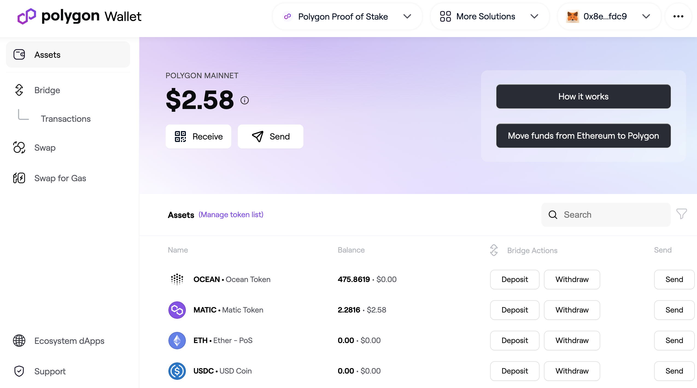
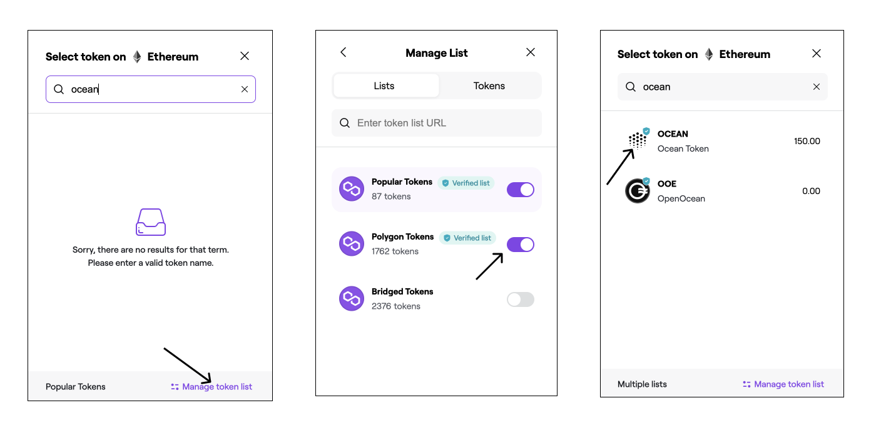
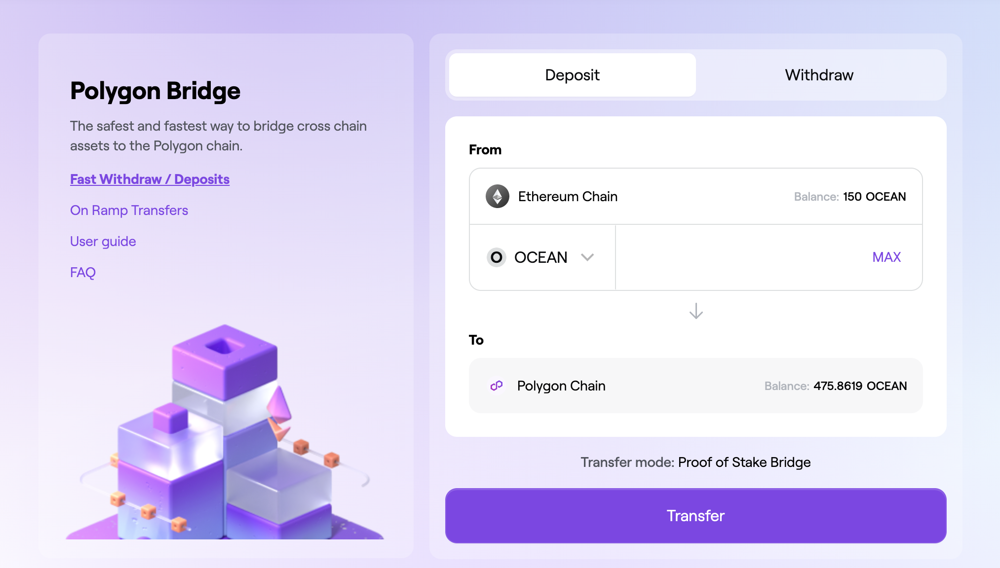

# Bridges

A bridge is a mechanism that connects two or more separate blockchain networks, enabling communication and interoperability between them. Bridges can be designed to facilitate the transfer of assets, data, or messages between different blockchain networks that may operate on different protocols, and consensus mechanisms, or have different native currencies.

We suggest using the following solutions to transfer Ocean tokens between Ethereum mainnet and Polygon or BSC.

## Binance Smart Chain (BSC) Bridge

To transfer Ocean tokens to and from the Binance Smart Chain, we recommend using the [Binance Bridge](https://www.bnbchain.org/en/bridge). BSC offers various options such as withdrawing crypto from [Binance](https://www.binance.com/en) and utilizing the [Binance Bridge](https://www.bnbchain.org/en/bridge). You can refer to the Binance Academy article "[How to Get Started with BSC](https://academy.binance.com/en/articles/how-to-get-started-with-binance-smart-chain-bsc)" for more information.


In case you opt for an alternative bridge option and intend to transfer tokens to Binance, it is crucial to ensure that the contract address you are sending the tokens to is correct.&#x20;

## &#x20;                            


## Polygon (ex Matic) Bridge

The Polygon Network (previously known as Matic) offers a [bridge](https://wallet.polygon.technology/bridge/), which lets you easily transfer digital assets between Ethereum and Polygon blockchains and a dedicated [wallet](https://wallet.polygon.technology/) designed for this purpose, which can be linked to your account through Metamask or other compatible wallets.&#x20;

All you need to do is click on the [wallet](https://wallet.polygon.technology/) link, select your preferred method of connection, and log in to get started. In this guide, we'll be using Metamask to connect the wallet.

You might come across the name "Matic" in some places instead of "Polygon" because the network is still using its old brand name in certain instances. Don't worry though, it's the same network whether you see Matic or Polygon. For the sake of this guide, we'll be using the name Matic in the following paragraphs because the interfaces we'll be using still use the old brand name.&#x20;

Check out our [blog post](https://blog.oceanprotocol.com/ocean-on-polygon-network-8abad19cbf47) for more details.

#### Deposit Tokens

When you access the wallet's main page, you'll be able to view all the tokens you possess on the Matic Mainnet. If you want to deposit tokens (i.e., transfer them from the Ethereum Mainnet), there are two ways to do it: you can either click the "deposit" button for a specific token or use the "Move funds to Matic Mainnet" option.

In case you are unable to find the Ocean token in the list while depositing, simply click on "Manage token list" and enable the Polygon Tokens option, which contains a greater number of listed tokens. This should add Ocean to the tokens list.

Both of these options will redirect you to the bridge interface. If you select the second option, you'll need to use the dropdown menu to choose the token that you wish to transfer from the Ethereum Mainnet.

Select the amount of tokens you want to transfer and hit the "Transfer" button. The bridge interface provided by Matic will guide you through all the necessary steps, including signing two transactions on the Ethereum Mainnet. The first transaction involves giving permission for the tokens to be traded on Matic's bridge, while the second transaction is the actual deposit.

#### Withdraw Tokens

The process of withdrawing tokens also utilizes the bridge interface, but this time the withdrawal will happen from Matic to the Ethereum Mainnet. The bridge interface will guide you through all the necessary steps for this process as well.&#x20;

For more detailed information about depositing and withdrawing actions, you can refer to the official Polygon [documentation](https://wiki.polygon.technology/docs/develop/ethereum-polygon/plasma/eth/).

#### Sending Tokens

Unlike the first two cases where transactions are signed on the Ethereum Mainnet, transferring tokens between two Matic addresses takes place on the Matic Mainnet. As a result, it's necessary to connect to the Matic network in order to sign these transactions. Setting up the network on Metamask can be done in several ways.

The easiest one is to go to the [polygon network explorer](https://polygonscan.com/) and tap on the "Add polygon network" button.

<figure><figcaption></figcaption></figure>

Alternatively, you can manually configure the network on Metamask by using the following parameters. To learn how to set up a custom network in Metamask using these values, you can refer to our guide.

| What               | Value                             |
| ------------------ | --------------------------------- |
| Network Name       | `Matic Mainnet`                   |
| RPC                | `https://polygon-rpc.com/`        |
| Chain Id           | `137`                             |
| Currency Symbol    | `MATIC`                           |
| Block Explorer URL | `https://explorer.matic.network/` |

Follow our guide to learn how to use those values to [set up a custom network in MetaMask](../metamask-setup.md#set-up-custom-network).
