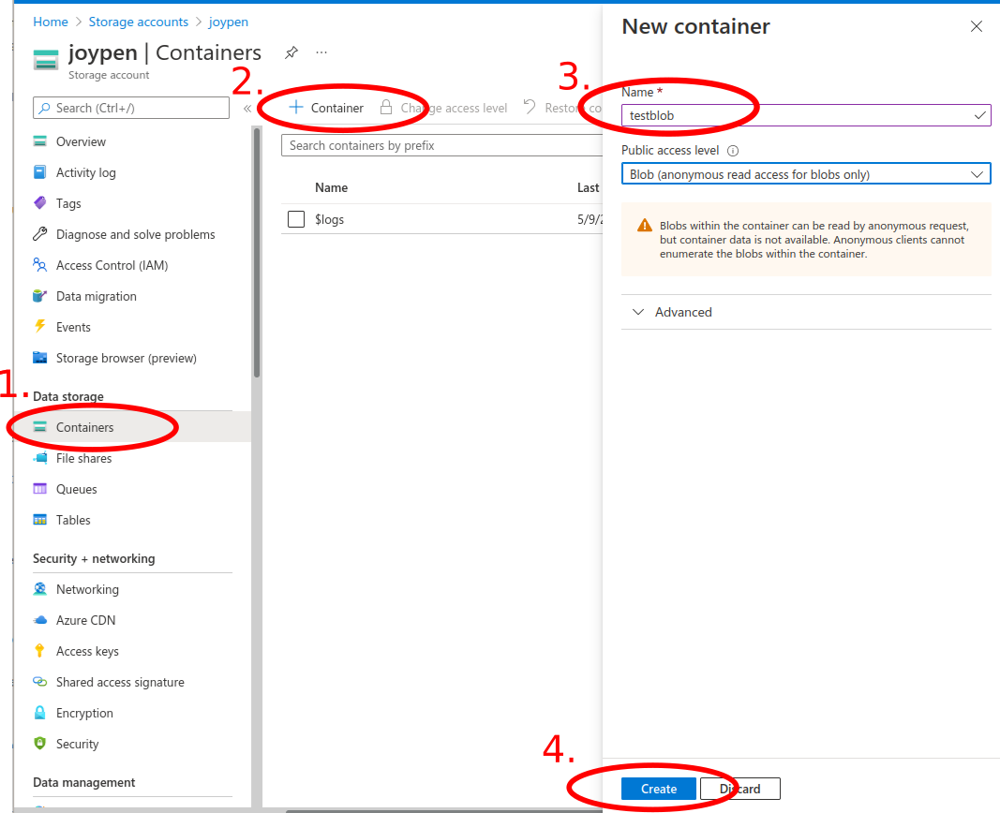

# Host Assets

Overview

To publish on the Ocean Marketplace, publishers must first host their assets! It is up to the asset publisher to decide where to host the asset. For example, a publisher can store the content on decentralized storage like Arweave or choose a centralized solution like their AWS server, private cloud server, or other third-party hosting services. Through publishing, the information required to access the asset is encrypted and stored as a part of DDO on the blockchain. Buyers don't have access directly to this information, but they interact with the [Provider](https://github.com/oceanprotocol/provider#provider), which decrypts it and acts as a proxy to serve the asset. The DDO only stores the location of the file, which is accessed on-demand by the Provider. Implementing a security policy that allows only the Provider to access the file and blocks requests from other unauthorized actors is recommended. One of the possible ways to achieve this is to allow only the Provider's IP address to access the data. But, not all hosting services provide this feature. So, the publishers must consider the security features while choosing a hosting service.

On Ocean Marketplace, a publisher must provide the asset information during the publish step in the field shown in the below image. The information is a `link` for a classic URL, a `transaction ID` for a file stored on Arweave or a `CID` for an IPFS file.

Publishers can choose any hosting service of their choice. The below section explains how to use commonly used hosting services with Ocean Marketplace.

⚠️ Note **Please use a proper hosting solution to keep your files.** Systems like `Google Drive` are not specifically designed for this use case. They include various virus checks and rate limiters that prevent the `Provider` to download the asset once it was purchased.

### Centralized hosting

#### Azure storage

Azure provides various options to host data and multiple configuration possibilities. Publishers are required to do their research and decide what would be the right choice. The below steps provide one of the possible ways to host data using Azure storage and publish it on Ocean Marketplace.

**Prerequisite**

Create an account on [Azure](https://azure.microsoft.com/en-us/). Users might also be asked to provide payment details and billing addresses that are out of this tutorial's scope.

**Step 1 - Create a storage account**

**Go to Azure portal**

Go to the Azure portal: https://portal.azure.com/#home and select `Storage accounts` as shown below.

**Create a new storage account**

.png>)

**Fill in the details**

**Storage account created**

.png>)

**Step 2 - Create a blob container**

**Step 3 - Upload a file**

.png>)

**Step 4 - Share the file**

**Select the file to be published and click Generate SAS**

**Configure the SAS details and click `Generate SAS token and URL`**

.png>)

**Copy the generated link**

.png>)

**Step 5 - Publish the asset using the generated link**

Now, copy and paste the link into the Publish page in the Ocean Marketplace.

