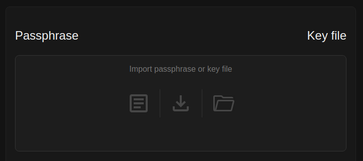
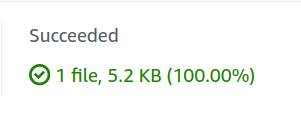
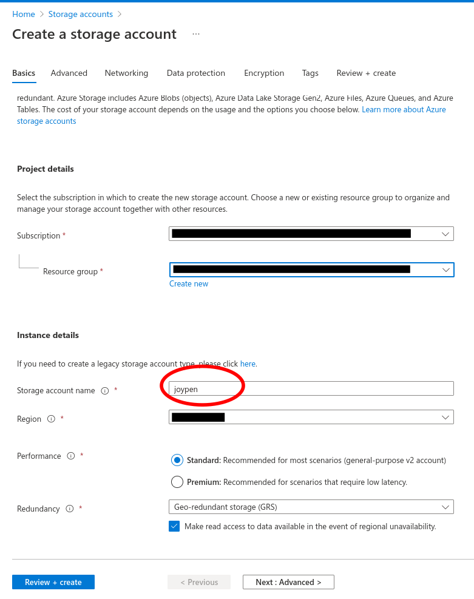

# Hosting Your Assets

### Overview

To publish on the Ocean Marketplace, publishers must first host their assets! It is up to the asset publisher to decide where to host the asset. For example, a publisher can store the content on decentralized storage like Arweave or choose a centralized solution like their AWS server, private cloud server, or other third-party hosting services. Through publishing, the information required to access the asset is encrypted and stored as a part of DDO on the blockchain. Buyers don't have access directly to this information, but they interact with the [Provider](https://github.com/oceanprotocol/provider#provider), which decrypts it and acts as a proxy to serve the asset. The DDO only stores the location of the file, which is accessed on-demand by the Provider. Implementing a security policy that allows only the Provider to access the file and blocks requests from other unauthorized actors is recommended. One of the possible ways to achieve this is to allow only the Provider's IP address to access the data. But, not all hosting services provide this feature. So, the publishers must consider the security features while choosing a hosting service.

On Ocean Marketplace, a publisher must provide the asset information during the publish step in the field shown in the below image. The information is a `link` for a classic URL, a `transaction ID` for a file stored on Arweave or a `CID` for an IPFS file.


Publishers can choose any hosting service of their choice. The below section explains how to use commonly used hosting services with Ocean Marketplace.

⚠️ Note **Please use a proper hosting solution to keep your files.** Systems like `Google Drive` are not specifically designed for this use case. They include various virus checks and rate limiters that prevent the `Provider` to download the asset once it was purchased.

### Decentralized hosting

#### Arweave

[Arweave](https://www.arweave.org/) is a global, permanent, and decentralized data storage layer that allows you to store documents and applications forever. Arweave is different from other decentralized storage solutions in that there is only one up-front cost to upload each file.

**Step 1 - Get a new wallet and AR tokens**

Download & save a new wallet (JSON key file) and receive a small amount of AR tokens for free using the [Arweave faucet](https://faucet.arweave.net/). If you already have an Arweave browser wallet, you can skip to Step 3.

At the time of writing, the faucet provides 0.02 AR which is more than enough to upload a file.

If at any point you need more AR tokens, you can fund your wallet from one of Arweave's [supported exchanges](https://arwiki.wiki/#/en/Exchanges).

**Step 2 - Load the key file into the arweave.app web wallet**

Open [arweave.app](https://arweave.app/) in a browser. Select the '+' icon in the bottom left corner of the screen. Import the JSON key file from step 1.



**Step 3 - Upload file**

Select the newly imported wallet by clicking the "blockies" style icon in the top left corner of the screen. Select **Send.** Click the **Data** field and select the file you wish to upload.


The fee in AR tokens will be calculated based on the size of the file and displayed near the bottom middle part of the screen. Select **Submit** to submit the transaction.

After submitting the transaction, select **Transactions** and wait until the transaction appears and eventually finalizes. This can take over 5 minutes so please be patient.

**Step 4 - Copy the transaction ID**

Once the transaction finalizes, select it, and copy the transaction ID.


**Step 5 - Publish the asset with the transaction ID**


### Centralized hosting

#### AWS

AWS provides various options to host data and multiple configuration possibilities. Publishers are required to do their research and decide what would be the right choice. The below steps provide one of the possible ways to host data using an AWS S3 bucket and publish it on Ocean Marketplace.

**Prerequisite**

Create an account on [AWS](https://aws.amazon.com/s3/). Users might also be asked to provide payment details and billing addresses that are out of this tutorial's scope.

**Step 1 - Create a storage account**

**Go to AWS portal**

Go to the AWS portal for S3: https://aws.amazon.com/s3/ and select from the upper right corner `Create an AWS account` as shown below.


**Fill in the details**

)

**Create a bucket**

After logging into the new account, search for the available services and select `S3` type of storage.


To create an S3 bucket, choose `Create bucket`.


Fill in the form with the necessary information. Then, the bucket is up & running.


**Step 2 - Upload asset on S3 bucket**

Now, the asset can be uploaded by selecting the bucket name and choosing `Upload` in the `Objects` tab.


**Add files to the bucket**

Get the files and add them to the bucket.

The file is an example used in multiple Ocean repositories, and it can be found [here](https://raw.githubusercontent.com/oceanprotocol/c2d-examples/main/branin\_and\_gpr/branin.arff).


The permissions and properties can be set afterward, for the moment keep them as default.

After selecting `Upload`, make sure that the status is `Succeeded`.



**Step 3 - Access the Object URL on S3 Bucket**

By default, the permissions of accessing the file from the S3 bucket are set to private. To publish an asset on the market, the S3 URL needs to be public. This step shows how to set up access control policies to grant permissions to others.

**Editing permissions**

Go to the `Permissions` tab and select `Edit` and then uncheck `Block all public access` boxes to give everyone read access to the object and click `Save`.

If editing the permissions is unavailable, modify the `Object Ownership` by enabling the ACLs as shown below.


**Modifying bucket policy**

To have the bucket granted public access, its policy needs to be modified likewise.

Note that the `<BUCKET-NAME>` must be chosen from the personal buckets dashboard.

```JSON
{
  "Version": "2012-10-17",
  "Statement": [
    {
      "Sid": "Public S3 Bucket",
      "Principal": "*",
      "Effect": "Allow",
      "Action": "s3:GetObject",
      "Resource": "arn:aws:s3:::<BUCKET-NAME>/*"
    }
  ]
}
```

After saving the changes, the bucket should appear as `Public` access.


**Verify the object URL on public access**

Select the file from the bucket that needs verification and select `Open`. Now download the file on your system.


**Step 4 - Get the S3 Bucket Link & Publish Asset on Market**

Now that the S3 endpoint has public access, the asset will be hosted successfully.

Go to [Ocean Market](https://market.oceanprotocol.com/publish/1) to complete the form for asset creation.

Copy the `Object URL` that can be found at `Object Overview` from the AWS S3 bucket and paste it into the `File` field from the form found at [step 2](https://market.oceanprotocol.com/publish/2) as it is illustrated below.


#### Azure storage

Azure provides various options to host data and multiple configuration possibilities. Publishers are required to do their research and decide what would be the right choice. The below steps provide one of the possible ways to host data using Azure storage and publish it on Ocean Marketplace.

**Prerequisite**

Create an account on [Azure](https://azure.microsoft.com/en-us/). Users might also be asked to provide payment details and billing addresses that are out of this tutorial's scope.

**Step 1 - Create a storage account**

**Go to Azure portal**

Go to the Azure portal: https://portal.azure.com/#home and select `Storage accounts` as shown below.


**Create a new storage account**

.png>)

**Fill in the details**



**Storage account created**

.png>)

**Step 2 - Create a blob container**


**Step 3 - Upload a file**

.png>)

**Step 4 - Share the file**

**Select the file to be published and click Generate SAS**


**Configure the SAS details and click `Generate SAS token and URL`**

.png>)

**Copy the generated link**

.png>)

**Step 5 - Publish the asset using the generated link**

Now, copy and paste the link into the Publish page in the Ocean Marketplace.


