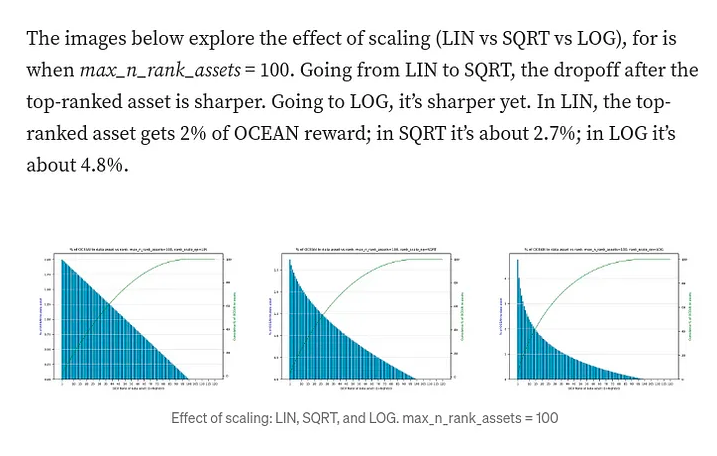

# Curate Data in Volume DF

<figure><figcaption>
You know enough to be dangerous.
</figcaption></figure>

## What is Volume DF

If you obtain veOCEAN to only get passive yield, then you're leaving money on the table.  

Volume DF rewards Data Farmers that allocate their veOCEAN tokens to Ocean ecosystem assets.  

It's called Volume DF because the amount of rewards relies on assets that are actively generating Data Consume Volume. Therefore, **Volume DF yields depend on the sales produced by these assets and allocations made.**  

No sales = no rewards.
So, choose your favorite datasets wisely & then allocate.  

## Data Curation Crops

Data Farming rewards farmers that allocate their veOCEAN tokens to assets that **generate revenue** in the Ocean ecosystem. (No revenue, no rewards.) In addition, Data Farming incentivizes **publishing** assets in the Ocean ecosystem too - you get **2x the Allocation Power** when you allocate to an asset that you publish!

Thus, if you really want to max out Volume DF APY:
1. Lock your OCEAN for 4 years to receive 100% voting power.
1. Have other participants delegate their Allocation Power to you.
1. Create & publish assets (and make $ in selling them) — or work with people who can.
1. Point your Allocation Power towards your published assets to receive a 2x bonus.
1. Claim weekly Passive Rewards, Active Rewards, and update your lock.

### Success Metrics

**Data Consume Volume (DCV)** is our term for **the total $ amount spent on purchases of Ocean ecosystem assets**, transaction fees, and more. The higher DCV of Ocean ecosystem assets, then the more OCEAN rewards are distributed to Data Farmers. It's that simple!

### Those assets don't sell themselves!

Marketing your assets to buyers can be a big challenge. Just because you publish them in the Ocean ecosystem doesn't mean that they will sell. It will take real work. Your reward is great APY. Its incentives all the way down 🙂

<figure><figcaption></figcaption></figure>

## Delegating Voting Power

Another way to improve your yield is by delegating to your veOCEAN to someone else that can generate Active Rewards for you! In this case, they may do a better job at publishing assets, curating winners, and have more market insights than you.

Another scenario is a user with multiple wallets that wants to manage Volume DF from a single wallet.

The Data Farming dApp [Delegate Page](https://df.oceandao.org/delegate) lets you easily manage delegations. Please keep in mind that the app assigns 100% of the current veOCEAN and the LockEnd time to set the delegation

Whatever your scenario, there may be some risk to delegating because the rewards generated will be sent to the person you delegated to. **It's their responsibility to return those rewards back to you if that's the agreement you both made.**

The guide on [how to Delegate](../user-guides/data-farming/how-to-delegate.md) shows how to provide another wallet with 100% of your allocation power.

### How Rewards are Calculated

The Reward Function (RF) governs how active rewards are allocated to Data Farmers.

**Rewards are calculated as follows:**

1. Distribute OCEAN across each asset **based on rank**: highest-DCV asset gets the most OCEAN, etc.
1. For each asset and each veOCEAN holder: If the holder is a publisher, 2x the effective allocation – Baseline rewards = (% allocation in asset) \* (OCEAN for an asset) – Bound rewards to the asset by 125% APY – Bound rewards by asset’s DCV \* 0.1%.
1. When DF restarts each Thursday, the global allocation towards each asset resets back to zero and then starts counting up again until the end of the round. After allocating your veOCEAN to different datasets, it will take time for your voting power to be accounted for. 

For mathematicians and coders, you can find this code inside [calcrewards.py](https://github.com/oceanprotocol/df-py/blob/main/df_py/volume/calc_rewards.py) in the Ocean Protocol [df-py repo](https://github.com/oceanprotocol/df-py/)!

### What are Publisher Rewards?

<figure><figcaption>
Publishing makes you *more* OCEAN rewards
</figcaption></figure>

Volume DF strongly incentivizes publishing assets in the Ocean ecosystem by giving double the active rewards to Data Farmers that allocate to their own published assets.

How is it calculated? _All the veOCEAN a Data Farmer has allocated to an asset they’ve published is **doubled for the rewards calculation.**_

You can read more about the implementation [in this blog post](https://blog.oceanprotocol.com/data-farming-publisher-rewards-f2639525e508).

### What are Ranked Rewards?

In Data Farming Round 23 Ranked Rewards were introduced to smooth out the reward distribution by using a logarithmic function.

**Since rewards are distributed across the Top 100 assets, all data farmers (Publishers & Curators) are now incentivized to support a broader range of assets rather than optimizing on a single asset.**

At the top-end, this helps increase the quality and diversification of inventory.

At the bottom-end, this eliminates some potential free-rider issues and smooths out the reward distribution.

You can read more about the why, what, and how of Ranked Rewards [in this blog post](https://blog.oceanprotocol.com/data-farming-df22-completed-df23-started-reward-function-tuned-ffd4359657ee) and find the full study [in these slides](https://docs.google.com/presentation/d/1HIA2zV8NUPpCELmi2WFwnAbHmFFrcXjNQiCpEqJ2Jdg/).

### Assets that Qualify for Data Farming

Data assets that have veOCEAN allocated towards them get Data Farming active rewards.

The asset may be of any type — dataset, an algorithm for Compute-to-Data, or any other Datatoken token-gated system. The asset may be fixed price or free price. If fixed price, any token of exchange is alright (OCEAN, H2O, USDC, etc).

To qualify for DF, an asset must also:

* Have been created by Ocean Smart contracts [deployed](https://github.com/oceanprotocol/contracts/blob/v4main/addresses/address.json) by OPF to [production networks](../discover/networks/README.md)
* The asset must be listed on Ocean Market
* Can’t be in [purgatory](https://github.com/oceanprotocol/list-purgatory/blob/main/policies/README.md)
